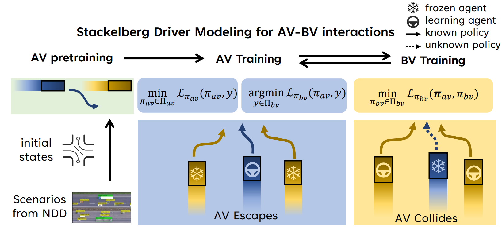

# SDM
SDM (Stackelberg Driver Model) ([https://arxiv.org/abs/2309.14235](https://arxiv.org/abs/2309.14235)) is a novel approach that aligns with the hierarchical nature of interactions between autonomous vehicle (AV) and background vehicles (BVs), facilitating AV performance improvement in a leader-follower order of play. We empirically demonstrate that AV and BV agents can both achieve better performance during the game with SDM. Essentially, SDM outperforms those competing baselines with simple adversarial training paradigms, non-game modeling and other game modeling approaches, especially in higher dimensional scenarios.

# Installation and Setups
To install the dependencies, run the command:

```bash
conda env create -f environment.yml
conda activate SDM
pip install -e .
```
Then, download our pre-processed dataset from [here](https://cloud.tsinghua.edu.cn/f/476b8b8824944f4b89dd/?dl=1), and unzip it using

```bash
unzip dataset.zip
```

# Run Experiments
We run experiments on SDM, Non-Game, SimGM, NSD and I-SDM. To begin with, enter the folder `Scripts`:

```bash
cd Scripts
```

Then you can run SDM and baselines using following example commands.

## Train AV and BV using SDM

```bash
python main_spg_ac_inv.py --r_ego stackelberg --r_adv stackelberg --is_save True --save_model True --adv_policy sumo --num_agents 5
```

## Train AV and BV using NSG

```bash
python main_NSG.py --r_adv stackelberg3 --r_ego stackelberg --is_save True --save_model True --pretrain_ego True --adv_policy sumo --num_agents 5
```

## Train AV and BV using SimGM

```bash
python main_SimGM.py --r_adv stackelberg2 --r_ego stackelberg --is_save True --save_model True --pretrain_ego True --adv_policy sumo --num_agents 5
```

# Visualization of Learning Curves
You can resort to [wandb](https://wandb.ai/site) to login your personal account with your wandb API key.

```bash
export WANDB_API_KEY=YOUR_WANDB_API_KEY
```

and using `--used_wandb True` to turn on the online syncronization.

# Acknowledgement
Our code mainly derives from [(Re)2H2O](https://github.com/Kun-k/Re_2_H2O). Many thanks to them!

# Citation
If you are using SDM framework or code for your project development, please cite the following paper:

```
@article{niu2023stackelberg,
  title={Stackelberg Driver Model for Continual Policy Improvement in Scenario-Based Closed-Loop Autonomous Driving},
  author={Niu, Haoyi and Chen, Qimao and Li, Yingyue and Hu, Jianming},
  journal={arXiv preprint arXiv:2309.14235},
  year={2023}
}
```


